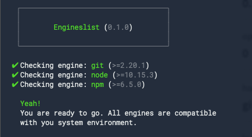

# NPM Supervisor 🎛

The NPM Supervisor checks your `package.json` engines version ranges against you
global and/or local installed binaries.



**Why?**

Because NPM does this only when someone else installs you program but sometimes
you don't want your friends to get errors with having the wrong node version.

## How to use

### Programmatically

```ts
import Supervisor from 'npm-supervisor'

const supervisor = new Supervisor({
  engines: {
    node: '>=10.3.0',
  },
})
```

> Psst! Have a look at our [tests](./test) to see more examples.

#### Options

| Name    | Type      | Default         | Description                              |
| ------- | --------- | --------------- | ---------------------------------------- |
| debug   | `boolean` | `false`         | Enables more verbose output.             |
| cwd     | `string`  | `process.cwd()` | Modify the string to search for engines. |
| engines | `Engines` | `null`          | Pass your own object of engines.         |
| silent  | `boolean` | `true`          | Just no interactive output.              |

### Command Line

```shell
$ npm-supervisor
```

#### Options

```shell
  Usage
    $ npm-engineer <directory>

  Options
    --ignoreLocal, -i  Ignore local installed node modules (true)

    --debug     Debug program
    --version   Show version
    --help      Show help
```
